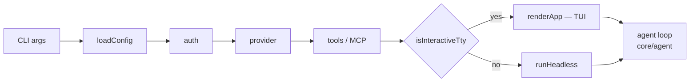
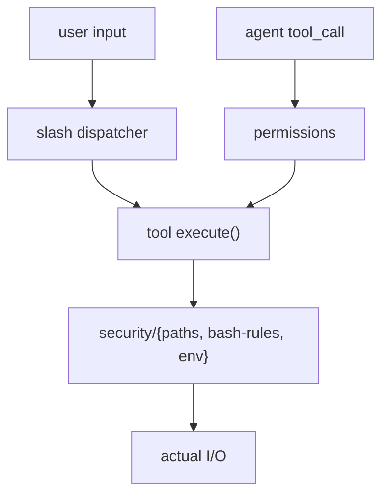

# Architecture

This document maps factory's internals so a new contributor can locate the right module quickly.

## High level



The entry in `src/index.ts` parses CLI flags, loads config, runs auth, picks a provider, registers tools, attaches MCP servers, then checks `isInteractiveTty` and dispatches to either `renderApp` (TUI) or `runHeadless` (scripted/non-TTY) — both eventually call into the same agent loop.

## Module map

### `src/index.ts`
Top-level `main()`. Parses argv, applies `--debug`, branches on `--version` / `--help`, loads config, applies rotation overrides, runs auth, wires hooks, registers tools, instantiates the `McpManager` (`src/mcp/client.ts`), prints the welcome banner, and dispatches to TUI or headless mode based on `isInteractiveTty`. Also installs `unhandledRejection` / `uncaughtException` handlers.

### `src/cli/`
- `args.ts` — argv parser (manual, no commander), `printUsage()`, `printVersion()`.
- `picker.ts` — line-based interactive provider/model selection.
- `prompts.ts` — Ink-based variant of the picker prompts.
- `auth/` — credential resolution and interactive auth flows (storage and model validation live in `src/core/auth/`):
  - `index.ts` — credential resolution: CLI → env var → config file → interactive prompt. Probes providers in parallel during startup. Returns `StartupCredentials` keyed by provider.
  - `flows.ts` — interactive auth flow helpers used during startup.
- `startup/` — startup orchestration:
  - `phases.ts` — per-phase functions called from `main()`.
  - `config.ts` — pure helpers for rotation/experimental/source decisions.
  - `menu.tsx` — Ink-rendered startup picker.
  - `parse-rotation.ts` — parses the `--rotate <p:m,p:m>` chain syntax.

### `src/core/`
The agent core. **`agent/run-agent.ts`** is the loop: stream model output, parse tool calls, dispatch, append results, loop until `done`. Sibling files under `agent/` split the loop into call/parse/run/compact/recover phases.

- `agent/` — the loop and its phases:
  - `run-agent.ts` — the top-level async generator; orchestrates one turn end-to-end.
  - `parse-response.ts` — content + tool-call extraction (with text-fallback recovery).
  - `compaction.ts` — invokes the context manager when the budget is hit.
  - `recovery-state.ts` — per-run counters for replay and token-limit retries.
  - `types.ts` — `AgentEvent`, `AgentOptions`, `RotationOptions`.
  - `cache/` — read-cache + cache-boundary helpers:
    - `file-cache.ts` — Read-tool dedup (mtime + lazy hash) plus compaction-summary fingerprints.
    - `cache-boundaries.ts` — provider cache-boundary placement for system prompt + history.
  - `call-model/` — provider invocation wrapper:
    - `call-model.ts` — entry that delegates to retry/rotation helpers and returns a chunk stream.
    - `call-model-retry.ts` — transient retry policy.
    - `call-model-rotation.ts` — fail-over across rotation chain on rate-limit/auth.
    - `provider-errors.ts` — rotation classifier.
    - `provider-retry.ts` — low-level retry-with-backoff primitive.
    - `repeat-detector.ts` — detects model output loops and aborts the turn.
    - `weak-tier.ts` — picks a cheaper model for the corrector sub-call.
  - `tool-calls/` — tool-call processing (parsing, correction, dispatch, execution):
    - `run-tool-calls.ts` — top-level dispatcher; permission/security gate + correction loop.
    - `run-tool-calls-execute.ts` — executes one approved call and records the result.
    - `run-tool-calls-cache.ts` — cache-hit short-circuit for repeat Read calls.
    - `bash-dedup.ts` — fires a one-shot nudge when the model spins on near-duplicate Bash calls.
    - `text-tool-parser.ts` — fallback parser for prose-embedded tool calls.
    - `tool-call-corrector.ts` — LLM-driven correction of malformed calls.
    - `tool-result-format.ts` — sentinel framing + imitation strip.
- `context/` — conversation state passed to the model:
  - `conversation.ts` — message history with token-cap elision.
  - `context-manager.ts` — recency window + summary compaction.
  - `system-prompt.ts` — dynamic system prompt generation (project facts, capabilities, tool list).
  - `project-facts.ts` — best-effort metadata extraction (cloc counts, README excerpt).
- `auth/` — credential storage (interactive resolution lives in `src/cli/auth/`):
  - `credentials.ts` — multi-key store and migration from older single-key formats.
  - `model-validation.ts` — model-id sanity checks at startup. Lives under `auth/` for historical reasons but is about provider model IDs, not credentials.
- `config/` — config file load/merge/save with zod-validated schema (`index.ts`, `merge.ts`, `types.ts`, `validate.ts`).
- `session/` — per-session telemetry:
  - `session-log.ts` — JSONL per-session logging in `~/.factory/sessions/`. Tracks provider auth, tool calls, model changes, errors.
  - `key-stats.ts` — per-key request and rate-limit counters.
- `hooks/` — user-configured shell hooks:
  - `index.ts` — hook executor (sandboxed env, forbidden-command guard).
  - `discovery.ts` — resolve hook entries by event + tool/matcher.
  - `trust.ts` — first-run trust prompts for new hook scripts.
- `skills/` — experimental conditional skills:
  - `loader.ts` — discover skill files and parse their headers.
  - `matcher.ts` — match-on-path / match-on-text rules.
  - `index.ts` — `SkillsRegistry` (in-memory, dedupes injections).
- `subagent/` — experimental delegation target:
  - `runner.ts` — runs a sub-agent loop with its own conversation and tool registry.
  - `bash-allowlist.ts` — restricted Bash policy for sub-agents.

### `src/providers/`
All providers implement the `Provider` interface. The shared `openai/` folder is an internal adapter (no registry entry of its own) that owns SSE parsing, streaming chunk handling, tool-call accumulation, and usage extraction; most providers delegate to it via `buildChatBody` / `sendOpenAiChat` / `streamOpenAiChat`.

Three flavors:

1. **Flat-file consumers of the shared adapter** — `cerebras.ts`, `groq.ts`, `mistral.ts`, `openrouter.ts`, `vercel.ts`, `llamacpp.ts`, `workersai.ts` are single files that delegate streaming and tool-call handling to `openai/`. `huggingface.ts` reuses only the tool-call helpers (its transport is the `@huggingface/inference` SDK).
2. **Folder-with-own-auth on the shared adapter** — `copilot/` and `googleaistudio/` use `openai/` for transport but carry their own auth flow alongside; `opencodezen/` is a proxy folder that re-exposes Anthropic/Google through a single OpenAI-compatible endpoint.
3. **Truly native** — `anthropic.ts` (uses `@anthropic-ai/sdk`), `ollama.ts` (uses the `ollama` package), and `cohere.ts` (hand-rolled) parse their own response shapes and don't touch `openai/`.

Cross-cutting files:
- `types.ts` — the `Provider` interface every adapter implements.
- `registry.ts` — maps a provider name to a constructor (no `openai` entry — the adapter is internal).
- `descriptors.ts` — per-provider metadata (display label, aliases, env vars, default host).

### `src/tools/`
Built-in tools plus the registry that exposes them. Each tool implements `ToolHandler` with a `definition` (LLM-facing JSON schema) and an `execute` that returns a `ToolResult`.

- `read.ts` — file read with byte-range and line-range support.
- `write.ts` — atomic file write.
- `edit.ts` — string-replace edit with read-before-write check.
- `bash.ts` — sandboxed shell execution.
- `glob.ts` — glob-based file listing.
- `grep.ts` — content search.
- `delegate.ts` — delegates to a sub-agent when the experimental `subagents` flag is on.
- `registry.ts` — maps tool name to handler; `ToolRegistry` registers each built-in.
- `index.ts` — exports the shared `defaultRegistry` instance.
- `types.ts` — `ToolHandler`, `ToolDefinition`, `ToolResult` shapes.
- `web/` — HTTP fetch + HTML rendering pipeline backing the WebFetch tool. The pipeline is:
  ```
  fetch.ts → html-tokenize.ts → html-render.ts → html-to-markdown.ts
  ```
  - `index.ts` — the `WebFetch` tool handler.
  - `fetch.ts` — HTTP client with content-type sniffing.
  - `html-tokenize.ts` — lightweight HTML tokenizer.
  - `html-render.ts` — top-level renderer entry.
  - `html-to-markdown.ts` — DOM walker that emits Markdown.

Tool execution is gated by `src/security/permissions.ts` (allow-once / allow-always / deny / domain whitelist) and the security policies in `src/security/` (path jail, env scrubbing, bash rule matching).

### `src/security/`
- `permissions.ts` — per-tool / per-domain interactive approval state machine.
- `paths.ts` — symlink-aware path jail with built-in deny list (`.ssh`, `.aws`, `.gnupg`, `/etc/shadow`, etc.) and user-configurable rules.
- `bash-rules.ts` — built-in forbidden patterns (`rm -rf /`, fork bomb, `curl|sh`, `dd to /dev/*`) plus user globs. Built-ins cannot be overridden.
- `env.ts` — deny-by-default env scrubbing with a small safe-vars whitelist.

### `src/ui/`
Two render targets: the React + Ink TUI under `tui/`, and the non-TTY `headless.ts`. Both paths call into the same `core/agent/run-agent.ts` loop.

`tui/`:
- `index.tsx` — `renderApp()` entry.
- `App.tsx` — tab host.
- `Session.tsx` — one tab's REPL.
- `format.ts` — assistant-text formatting helpers (used by the renderer).
- `types.ts` — `DisplayItem`, `ToolCallSummary`, and other view-model types.
- `agent-loop/` — DI'd helpers around the React hook that drives the loop:
  - `use-agent-loop.ts` — the orchestrator hook itself.
  - `init.ts`, `setup.ts`, `swap.ts` — session bootstrap and provider/model swap.
  - `run-loop.ts` — drives one turn, consumes `AgentEvent`s.
  - `event-handler.ts` — maps `AgentEvent` → display-item / state mutations.
  - `history.ts` — input history stack.
  - `git-state.ts` — branch + dirty refresh.
  - `compose-system-prompt.ts` — per-turn system prompt composition.
  - `agent-loop-types.ts` — `RunRefs`, `AgentLoopApi`, `AgentLoopDeps` shapes.
- `components/` — Ink components (status bar, conversation display, permission panel, plan-approval panel, rotation prompt, etc.).
- `slash/` — user-typed slash commands; `dispatch.ts` is the entry, individual handlers live alongside (`hooks.ts`, `keys.ts`, `rotate.ts`, `rotate-helpers.ts`, `rotate-subcommands.ts`, `stats.ts`).
- `hooks/` — small React hooks (`use-rotation-fallback.ts`, `use-session-input.ts`).
- `tabs/` — tab registry/context (`tabs-registry.ts`, `TabsContext.tsx`, `use-tabs.ts`).

Top-level files:
- `headless.ts` — non-TTY entry point used for scripted runs and CI. Reads from stdin, writes to stdout, no Ink.
- `renderer.ts` — markdown-to-terminal pipeline (marked + marked-terminal, with a patch for inline-token rendering and a guard against unsupported highlight.js languages).

### `src/mcp/`
Model Context Protocol integration.

- `client.ts` — connects to external MCP servers as child processes.
- `adapter.ts` — wraps each remote tool as a `ToolHandler` so they slot into the same registry as built-in tools.
- `types.ts` — shared MCP types.

### `src/utils/`
Small helpers.

- `errors.ts` — extract `error.message`.
- `git.ts` — branch / dirty detection.
- `tokens.ts` — `CHARS_PER_TOKEN` constant + estimator.
- `glob-match.ts` — POSIX-glob to regex.
- `atomic-write.ts` — write-then-rename file write.
- `json-extract.ts` — extract JSON from prose.
- `build-info.ts` — build metadata loader.
- `debug.ts` — debug logging gate.
- `timeout.ts` — promise timeout helper.

## Build & distribution

- Source: `src/` → `dist/` via `tsc` (Node16 module, ES2022 target, declaration maps).
- Entry: `dist/index.js` ships with a `#!/usr/bin/env node` shebang.
- `package.json:bin.factory` makes `factory` available globally after `npm install -g` or `npm link`.
- `package.json:files` allowlists `dist`, `README.md`, `LICENSE` for the npm tarball; `.npmignore` is defense-in-depth.
- Ambient declarations live in `src/globals.d.ts` (e.g. `marked-terminal` typings).
- Unit tests run directly against TS source via `tsx --test 'test/unit/**/*.test.ts'` (no compile step). Unit tests mirror `src/` under `test/unit/`.
- End-to-end tests compile both `src/` and `test/` into `dist-test/` via `tsconfig.test.json` and run with `node --test`. The harness lives at the top of `test/`: `e2e-mocks.test.ts` and `e2e-no-mocks.test.ts` are the suites, `cli-harness.ts` spawns the built binary, and `mock-copilot-server.ts` / `mock-ollama-server.ts` stub provider endpoints.

## Data flow: one user prompt → one response

1. User types into the input bar in `Session.tsx`.
2. `Session.tsx` wires the input bar to `useSessionInput` (`src/ui/tui/hooks/use-session-input.ts`); its `handleSubmit` dispatches: slash commands go to `dispatchSlashCommand`; plain text becomes `agent.queueInput(text)` on the `useAgentLoop` API.
3. `use-agent-loop.ts` queues the message into a `Conversation` (from `core/context/conversation.ts`), then calls into `core/agent/run-agent.ts:runAgent`.
4. `runAgent` builds the system prompt via `core/context/system-prompt.ts`, applies cache boundaries via `agent/cache/cache-boundaries.ts`, then calls `agent/call-model/call-model.ts:callModel` which streams from the provider.
5. The provider's `chat()` method yields `ChatChunk`s — content deltas, tool calls, and a final `done: true` with usage. `runAgent` consumes these and emits `AgentEvent`s.
6. Events flow back to `use-agent-loop.ts` → `agent-loop/event-handler.ts:handleAgentEvent`, which mutates streaming state and the display item list.
7. When the model emits `tool_calls`, `agent/tool-calls/run-tool-calls.ts` is invoked: each call is permission-checked (`src/security/permissions.ts`), security-checked (`src/security/`), executed, and the result appended to the conversation as a `tool` message.
8. The loop repeats until the model returns `done: true` without tool calls, or until the turn timeout triggers.
9. `core/session/session-log.ts` writes JSONL events throughout (start, model-changes, tool-call, tool-call-result, turn-complete, errors).

## Permission and security layering



`src/security/permissions.ts` decides per-tool / per-domain whether a call needs interactive approval. `src/security/` checks the *content* of the call: paths must pass the jail, bash commands must not match a forbidden pattern, env vars passed to spawned shells are scrubbed against the deny list. Both layers must approve before execution.

Built-in security rules cannot be overridden by user config — only extended.

## Where to start when adding...

| Change | Touch |
|--------|-------|
| New CLI flag | `src/cli/args.ts` (parser + usage) → `src/index.ts` (apply) |
| New provider | `src/providers/<name>.ts` (or folder) + `descriptors.ts` + `registry.ts`. For OpenAI-compatible APIs, delegate transport to `./openai/index.js` (`buildChatBody`, `sendOpenAiChat`, `streamOpenAiChat`) — see `vercel.ts` or `groq.ts` as a template. (See [CONTRIBUTING.md](CONTRIBUTING.md).) |
| New tool | `src/tools/<name>.ts` + `src/tools/registry.ts` (register in `ToolRegistry`) |
| New slash command | `src/ui/tui/slash/<name>.ts` + `src/ui/tui/slash/dispatch.ts` (dispatcher) |
| New session-log event | add a method on the `SessionLogger` interface in `src/core/session/session-log.ts` (alongside `logModelChange`, `logToolCall`, etc.) + call it from where the event fires |
| New security rule | `src/security/<area>.ts` — built-in rules are an export list |
| New hook event | `src/core/hooks/discovery.ts` (event enum) + caller (where the hook fires) |
| New skill matcher | `src/core/skills/matcher.ts` |
